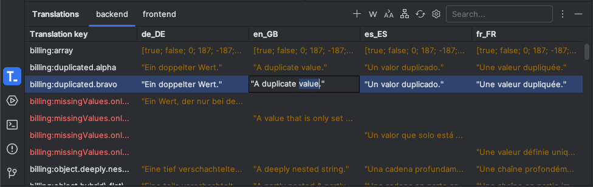
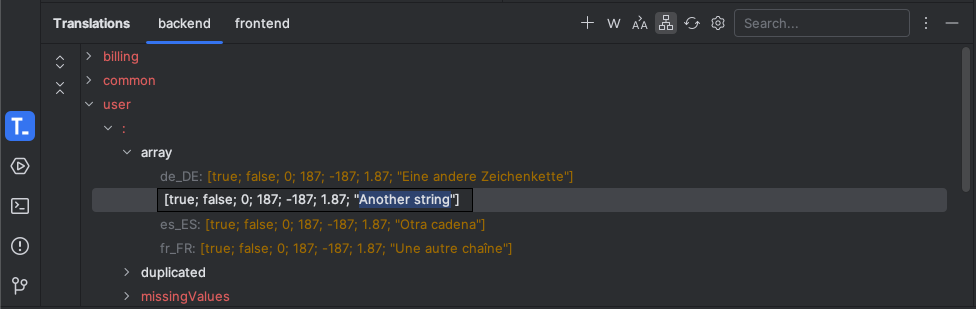
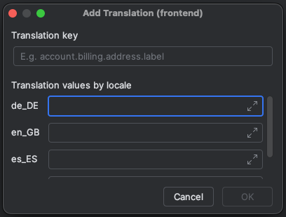
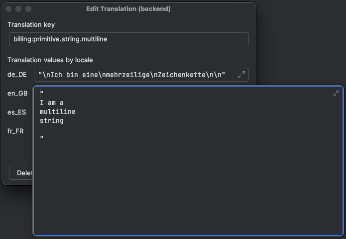

<!-- PROJECT SHIELDS -->

<!-- PROJECT LOGO -->
 

  

  <h3 align="center">Easy I18n</h3>

  

    <a href="https://marhali.github.io/easy-i18n/">Documentation</a>
    ·
    <a href="https://github.com/marhali/easy-i18n/tree/main/examples">Examples</a>
    ·
    <a href="https://github.com/marhali/easy-i18n/issues/new?labels=bug">Report Bug</a>
    ·
    <a href="https://github.com/marhali/easy-i18n/issues/new?labels=enhancement">Request Feature</a>
  

<!-- Plugin description -->
Easy I18n is a plugin based on the [IntelliJ Platform SDK](https://plugins.jetbrains.com/docs/intellij/welcome.html) to handle the process of [internationalization](https://en.wikipedia.org/wiki/Internationalization_and_localization) in your project.

> **Translating large projects using your favorite IDE has never been easier!**

This plugin offers a wide range of [configuration options](docs/configuration/index.md) to adapt to the specific requirements of the project.
However, to help you get started quickly, there are a variety of [presets](docs/configuration/presets.md) for common use cases.

___

## Features

- Support for Multi-Module projects, ideally for monorepos
- [Translations Tool Window](docs/components/tool-window.md) to manage all your translations in a single place
    - Visualize as _tree_ or _table_ view
    - Filter by _full-text-search_ query
    - Filter and highlighting of _duplicate_ or _missing_ translation values
- Easily **Add** / **Edit** or **Delete** translations via the [Translation Dialog](docs/components/dialog.md) or [Tool Window](docs/components/tool-window.md)
- Configuring of translation sources using a powerful [template syntax](docs/configuration/template-syntax.md)
- Fine-grained editor assistance using user-defined [rules](docs/configuration/editor-rules.md)
    - Referencing of translation keys to quickly jump the [Translation Dialog](docs/components/dialog.md)
    - Inspection to find unresolved translation keys
    - Quickfix intention action to add translations
    - Extract translation action to localize hard-coded literals
    - Documentation provider to preview translation values
    - Folding of translation keys with preview locale value

## Builtin Support

### File Types

`JSON` - `JSON5` - `YAML` - `Properties`

### Editor Language Assistance

`HTML/XML` - `JS(X)` - `TS(X)` - `Vue` - `Svelte` - `PHP` - `Ruby` - `Rust` - `Go` - `Dart` - `Python` - `Kotlin` - `Java`
<!-- Plugin description end -->

---

## Getting Started

### Installation

#### Using built-in plugin catalog inside your IDE  _(recommended)_

<kbd>Settings / Preferences</kbd> > <kbd>Plugins</kbd> > <kbd>Marketplace</kbd> > <kbd>Search for "easy-i18n"</kbd> > <kbd>Install Plugin</kbd>

#### Manual

Download the [latest release](https://github.com/marhali/easy-i18n/releases/latest) and install it manually using <kbd>Settings / Preferences</kbd> > <kbd>Plugins</kbd> > <kbd>⚙️</kbd> > <kbd>Install plugin from disk...</kbd>

### Configuration

- Show the [Translations Tool Window](docs/components/tool-window.md) if not already in displayed via <kbd>View</kbd> > <kbd>Tool Windows</kbd> > <kbd>Translations</kbd>
- Go to the plugin configuration via the <kbd>⚙️</kbd> action inside the tool window or by visiting <kbd>Settings / Preferences</kbd> > <kbd>Tools</kbd> > <kbd>Easy I18n</kbd>
- Configure common options like sorting or preview locale
- Add your first module and optionally select one of the existing presets to get started easily

**Hurray 🎉🥳 You are now ready to manage your translations**

Fore more detailed instructions see the [configuration overview](docs/configuration/index.md).

## Screenshots

_For more examples, please refer to the [examples](examples/README.md)._

<!-- ROADMAP -->
## Roadmap

- Support JS / TS files as translation resources
- Rename translations right from the editor

See the [open issues](https://github.com/marhali/easy-i18n/issues) for a full list of proposed features (and known issues).

<!-- CONTRIBUTING -->
## Contributing

Contributions are what make the open source community such an amazing place to learn, inspire, and create. Any contributions you make are **greatly appreciated**.

If you have a suggestion that would make this better, please fork the repo and create a pull request. You can also simply open an issue with the tag "enhancement".
Don't forget to give the project a star! Thanks again!

1. Fork the Project
2. Create your Feature Branch (`git checkout -b feature/AmazingFeature`)
3. Commit your Changes (`git commit -m 'Add some AmazingFeature'`)
4. Push to the Branch (`git push origin feature/AmazingFeature`)
5. Open a Pull Request

<!-- LICENSE -->
## License

Distributed under the MIT License. See [LICENSE](LICENSE) for more information.

<!-- CONTACT -->
## Contact

Marcel Haßlinger - [@marhali_de](https://twitter.com/marhali_de) - [Portfolio Website](https://marhali.de)

Project Link: [https://github.com/marhali/easy-i18n](https://github.com/marhali/easy-i18n)

<!-- DONATION -->
## Donation
If the project helps you to reduce development time, you can give me a [cup of coffee](https://paypal.me/marhalide) :)

---
Plugin based on the [IntelliJ Platform Plugin Template][template].

<!-- MARKDOWN LINKS & IMAGES -->
[template]: https://github.com/JetBrains/intellij-platform-plugin-template
