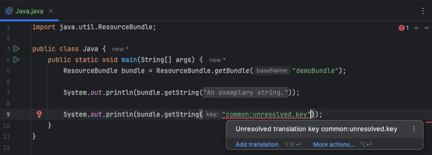
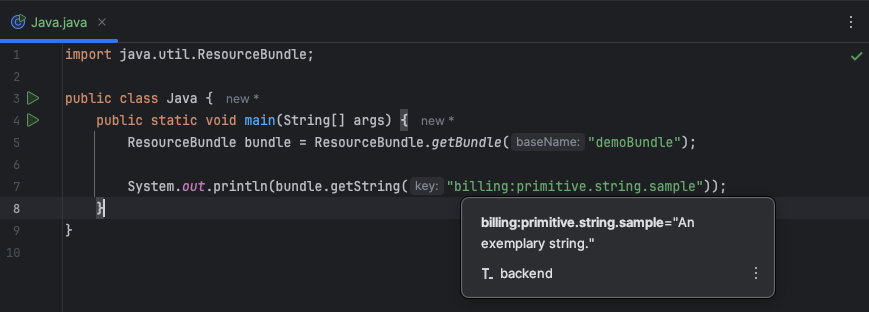
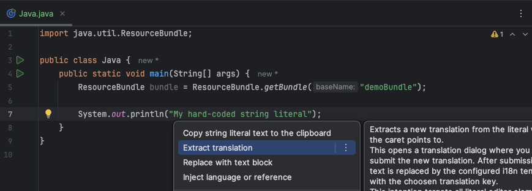

# Editor Assistance

The plugin offers a wide range of features to assist developers in the code editor.

To power this, appropriate rules are defined for each project using the [editor rules configuration](../configuration/editor-rules.md) to specify which elements within the code should be supported.

## Assistance Features

- Translation key reference (`Go To Declaration`) opens [Edit Translation Dialog](dialog.md)
- Documentation provider on translation keys to show the translated value for the configured preview locale
- Translation key inspection to find unresolved translations and a quick fix to open the [Add Translation Dialog](dialog.md)
- Folding of translation keys against configured preview locale value
- Extract translation action for hard-coded literals

## Screenshots

