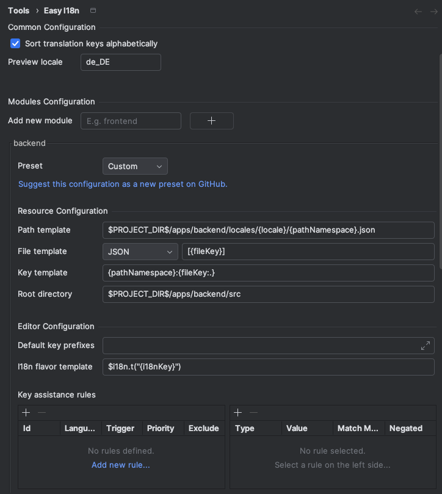

# Examples

The repository on GitHub contains a few examples on how this plugin can be utilized.

- [monorepo](https://github.com/marhali/easy-i18n/tree/main/examples/monorepo)
- [development](https://github.com/marhali/easy-i18n/tree/main/examples/development)

---

## Screenshots

